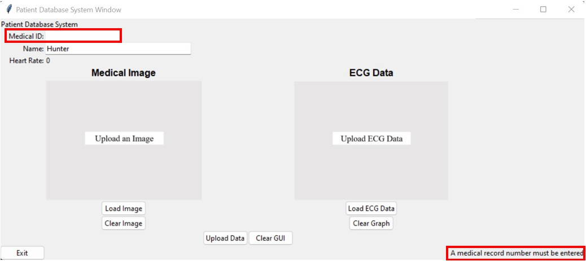
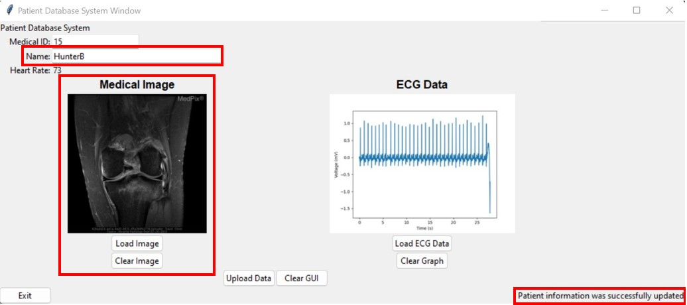
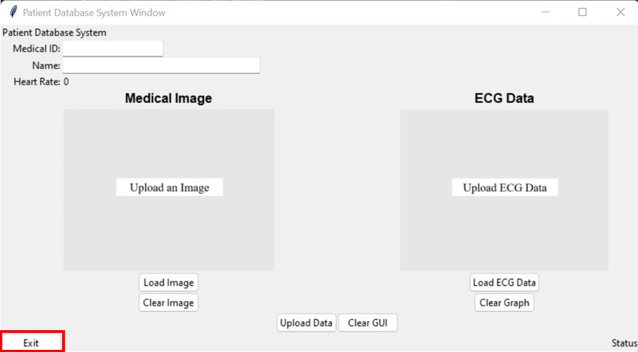

# Patient Monitoring Client/Server Project

### **_Authors:_**
Hunter Bernier and Zac Spalding
## **_License:_**
MIT License
## **_Purpose:_**
The code within this repository builds a patient monitoring server. The server was built to recieve GET and POST requests that contain patient information inputted from two separate GUIs (See "How to Run/Use GUIs" section for instructions on each GUI). The GUIs communicate to the server and the server communicates to the database (See "About Database" section for more information). The server will allow the following API routes:
1. POST Request:
    * `/new_patient`
2. GET Request:
    * `/medical_record_numbers`
3. GET Request:
    * `/patient_data/<medical_record_number>`

See "Details Regarding Each Route" section below for more information on each route.

The current state of this project allows for a user to easily populate the patient database with a GUI designated for the upload of patient information. This GUI condenses the server route for adding a new patient (route 1) into multiple data entry fields and buttons to allow for customizable patient information to be uploaded to the patient database (See "Patient GUI" section of "How to Run/Use GUIs" below for more information on this GUI). This project also implements a patient monitoring GUI, which retrieves patient data from the patient database hosted by our server for easy viewing. In a medical setting, this GUI acts as a monitoring station usable by medical staff to view and download patient information. This GUI condenses the server routes for retrieving patients and their information from the server (routes 2 and 3) into an interface where selections on patients or what patient data should be displayed are made through a combinations of dropdown boxes and buttons (See "Patient Monitoring GUI" section of "How to Run/Use GUIs" below for more information on this GUI). Together, these GUIs and the server act as a fully encapsulated patient monitoring system implemntable in medical settings requiring patient monitoring. A demonstration of each GUI and their interactions to create the patient monitoring system are demonstrated in the video below (click on the video image to be taken to the video on YouTube):

[](https://youtu.be/xTCZaIa9oeA)


## **_Details Regarding Each Route:_**
1. `POST /new_patient`
    * Takes a JSON input as follows:
        ```
        {
            "med_rec": <medical_record_integer>
            "name": <patient_name_string>
            "heart_rate": <heart_rate_integer>
            "ecg_str": <ecg_b64_string>
            "img_str": <image_b64_string>
        }
        ```
        where
        * `<medical_record_integer>` is an integer containing the patient's medical record number
        * `<patient_name_string>` is a string containing the patient's name
        * `<heart_rate_integer>` is an integer containing the heart rate of the ecg graph
        * `<ecg_b64_string>` is a string containing the unique base64 string of the uploaded ecg graph image
        * `<image_b64_string>` is a string containing the unique base64 string of the uploaded medical image
    * This route adds new patient data to the database or updates patient data of pre-existing patients within the database
2. `GET /medical_record_numbers`
    * Queries the patient database server to return a list of all registered medical record numbers associated with patients in the database.
    * Returns a list of the medical record numbers as a JSON string containg the list (can call `<request result>.json()` to get the list of medical record numbers)
    * If no patients are in the database, the route returns an empty list in a JSON string format as described above.
3. `GET /patient_data/<medical_record_number>`
    * Queries the patient database server to return a dictionary in a JSON string containing all patient data associated with the given medical record number.
    * The medical record number provide in the route address as a string must be a numeric string that is associated with a patient already registered in the database. If these conditions are not met, the route will return a 400 status code and a message detailing the issue with the request.
    * Patient data dictionary returned by this route has the following format:
        ```
        {
            _id: <int>
            name: <str>
            med_images: <list of str>
            heart_rates: <list of int>
            ecg_images: <list of str>
            timestamps: <list of str>
            _cls: <str>
        }
        ```
        where
        * `_id` is the medical record number of patient (has key `_id` due to storage as primary key in MongoDB patient database)
        * `name` is the name of patient
        * `med_images` is the list of base64 medical image encoding strings
        * `ecg_images` is the list of base64 ECG image encoding strings
        * `heart_rates` is the list of heart rate values in bpm
        * `timestamps` is the list of timestamps for ECG uploads
        * `_cls` is the class of object (always 'database_definition.Patient')
    * As patients are only required to have a medical record number to be uploaded to the patient database, the patient data dictionary returned by this route will only be guaranteed to have the `_id` and `_cls` keys. All other keys may be present or absent depending on the patient data uploaded to the database. If making a request to this route and processing the patient data,
    make sure to check for existence of keys before accessing them.
## **_About Database:_**
The database used for the patient information is hosted by MongoDB, https://www.mongodb.com/home. Each patient within the database has the following information fields:
* Patient:
    ```
    {
        _id (primary key): <medical_record_integer>
        name: <name_of_patient>
        med_images: <list_of_medical_image_b64_strings>
        heart_rates: <list_of_heart_rates>
        ecg_images: <list_of_ecg_image_b64_strings>
        timestamps: <list_of_timestamps>
    }
    ```
Each patient, at the bare minimum, will have a patient id. These fields are filled in through the use of the Patient GUI (See "How to Run/Use GUIs" section for more information on how this GUI works).
## **_How to Run/Use GUIs:_**
Before running the GUIS, make sure that you have properly cloned this repository and are in the root directory of the repository. Also, make sure that you have installed the required packages listed in the `requirements.txt` file. To install the required packages, create a Python virtual environment and run `pip install -r requirements.txt` in the terminal.
### **Patient GUI:**
* Note: To see the GUI in real-time use, see the video demonstration in the "Purpose" section at the top of this README.
1. Run `python patient_gui.py` in the terminal to open the GUI
2. The GUI will initially look like this:  

3. The user will then enter a medical ID number into the "Medical ID" box and the name of the patient into the "Name" box (if applicable):  

4. If the "Medical ID" box is filled with non-numeric values, an error will occur when trying to upload the data to the database:  

5. If the "Medical ID" box is left empty, an error will occur when trying to upload the data to the database:  

6. The user will then upload a medical image for that given patient (if applicable) by clicking the "Load Image" button:  

7. The selected medical image will then be dispalyed over the default medical image on GUI:  

8. This image can be cleared from the GUI at any point by clicking the "Clear Image" button and the default medical image will return:  

9. The user will then upload ECG data (as a `.csv` file) for that given patient (if applicable) by clicking the "Load ECG Data" button:  

10. The selected ECG data will be plotted and a corresponding heart rate will be calculated. The ECG plot and heart rate will be displayed on the GUI:  

11. The plot and the heart rate can be cleared from the GUI at any point by clicking the "Clear Graph" button. The default ECG image will return and the heart rate will be set back to 0:  

12. Once all the patient information is uploaded to the GUI, the user will then upload the data to the database by clicking the "Upload Data" button:  

13. If everything is correct, the GUI will tell the user that the patient information was successfully added to the database:  

14. If information for a particular patient needs to be updated, the user should enter the patient's medical ID, update any field within the GUI, and click "Upload Data". This will update any information within the database for that patient. The name will be changed within the database and any new medical or ECG images and heart rate will be added to the patient's file:  

15. If the user wants to begin adding information for a new patient, clicking the "Clear GUI" button will clear all fields within the GUI:  

16. Once the user is finished using the GUI, clicking the "Exit" button closes the window:  


### **Patient Monitoring GUI:**
* Note: To see the GUI in real-time use, see the video demonstration in the "Purpose" section at the top of this README.
1. Run `python monitoring_gui.py` in the terminal to open the GUI
2. The GUI will initially look like this:  

3. To begin, the user will select a patient from the dropdown menu at the top of the GUI. This box will be populated with all the patients currently in the database:  

4. After selecting a patient, the user will click the "Retrieve Patient" button to load the patient's information into the GUI from the patient database:  

5. After pressing the "Retrieve Patient" button, the patient's information will be populated into the fields below. The upper left box shows the patients medical record number and name displayed. Below that, the GUI will load the most recent set of ECG data for the patient. An image of the ECG trace will be dispalyed in the image box, and the heart rate from the ECG data and timestamp recording the date and time of measurement will be displayed below the ECG trace. Notice that the status bar in the bottom left updates to show that the patient's information has been successfully loaded. This status bar will update to show success or errors in response to user actions:  

6. Once a patient is loaded in, the dropdown boxes in the "Medical Image" and "Selected ECG Data" sections will be populated with lists of all medical images and historical ECG measurements for the patient. The ECG data selection includes previous ECG data as well as the most recent ECG data already displayed in the "Latest ECG Data" section. After selecting an image or ECG data from the dropdown boxes, the user will click the "View Medical Image" or "Get ECG Data" buttons to display the selected image or ECG data on the GUI. For the medical image, this will display the image. For the ECG data, this will display the ECG trace, the calculated heart rate, and the timestamp of the ECG measurement. If the user tries to view an ECG data or medical image without first selecting a patient, no imae will be shown and the status bar will update to show the issue:    


7. The user is able to save the currently displayed ECG trace image and medical image locally to their computer from the GUI by clicking the "Save ECG Image" and "Save Medical Image" buttons, respectively. This will open a dialog box where the user can select the location to save the image and the name of the image. The image will be saved in the format of a JPEG (`*.jpg`) image:  


8. While the GUI is open, it will make requests to the server every 15 seconds to gather the latest patient data. If a patient is currently selected in the GUI, updates to the patient data will be gathered from the server for that patient. If updates to the name have been made, the new name will be displayed in the "Patient Data" section. If new ECG data is available, it will automatically downloaded and displayed in the "Latest ECG Data" section. The medical image and selected ECG data will remain the same as before the update. The list of patient medical record numbers at the top of the GUI for patient selection will also be updated to the user can view newly added patients. The status message bar at the bottom left of the GUI will display when these updates occur. If a patient is not currently selected, then only the list of patient medical record numbers to select from will be updated:  


9. Finally, when done using the GUI, the user may exit by clicking the "Exit" button. This will close the GUI window. The GUI will not retain any information in the fields when the window is closed:  


## **_Details Regarding Virtual Machine:_**

The patient database server is hosted on a virtual machine owned by Duke University. This hosting is supported by Duke through the class BME 547. The server can be accessed on the virtual machine with the following URL:
```
http://vcm-29733.vm.duke.edu:5000
```
